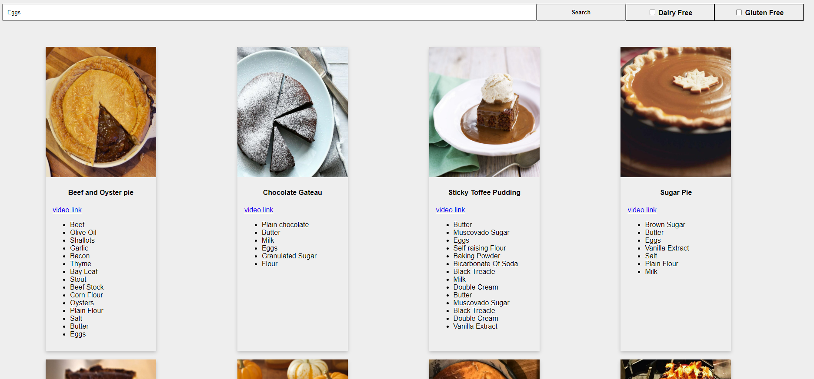
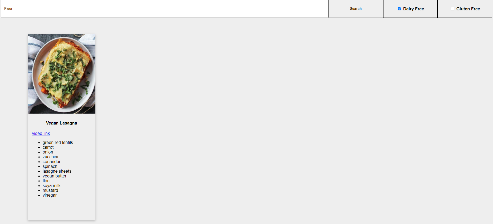

<H1> Recipe App</H1>

RecipeApp is a project which let the user search recipes
by a specific ingredeint. The user also can mark checkboxes
in order to declare about diffrent sensitivities (dairy and gluten).

<H1> Screenshots </H1>

Example of results when check 'Dairy Free' opeion
